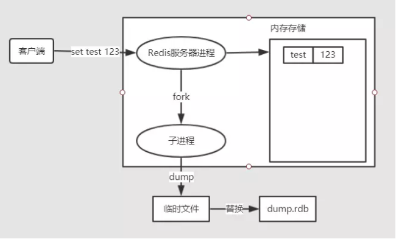

# Redis 持久化策略

## 数据写入流程 

服务 ----> 系统缓冲区  --->磁盘缓冲区------>真正落盘  
因此在讨论redis持久化的时候需要分析故障是发生在redis服务还是发生在系统宕机

## RDB（Redis Dump Binary） 

快照方式，redis通过定时触发快照操作持久化保存数据。分为save和bgsave两种方式，svae会阻塞进程，一般采用bgsave的方式。bgsave会在规定的频率（时间和改变两种维度）fork出当前的数据集，在额外的进程中进行快照的操作。  
RDB本身是一种非常紧凑的数据格式，所以非常地省空间 

 

## AOF （Append Only File） 

Redis会记录Redis操作的每个步骤。同样也有三种方式： 
* appendfsync always: 每次写入都会立即向磁盘同步 
* Appendfsync everysec: 每秒钟进行一次同步 
* Appendfsync no: 具体的同步策略由操作系统来决定

appendfsync指的是j将aof_buf的数据写入磁盘的同步操作。为了保证效率，redis会将每次操作写入到aof_buf中，而只有将aof_buf的数据真正落盘，数据才算真正完成持久化的操作。  

### AOF Rewrite 

由于每次历史的各种操作中可能很多数据删除了又加回来，或者多次变更，因此会对AOF 文件的存储上的浪费，rewrite会在固定时间执行（也是fork出一个新的进程），将一些冗余的操作进行合并，从而达到节省空间的效果。值得注意的是: AOF 重写是对当前数据库状态的重写，而不会分析历史的aof文件 
 

### 优缺点对比： 

类型   |AOF|RDB
:----|:----|:----
数据安全性|更好，因为每次操作都会被记录。虽然aof_buf向磁盘落盘的过程可能会有风险，选择appendfsync everysec的方式也能保证秒级别的数据安全 |安全性稍差，因为快照的频率不会太高（每次fork还是比较耗资源的）。频率比较低的话会造成数据的丢失
效率|较差，因为每次操作都需要额外的记录|比较好，频率不是特别夸张的话
数据恢复速度| 慢| 快
空间占用|小|比较大