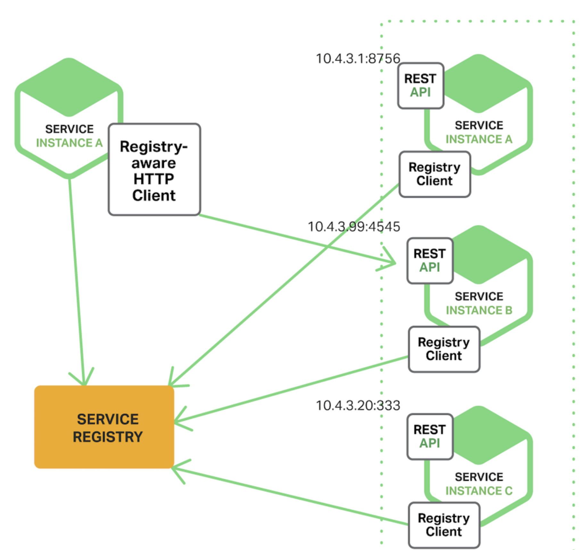
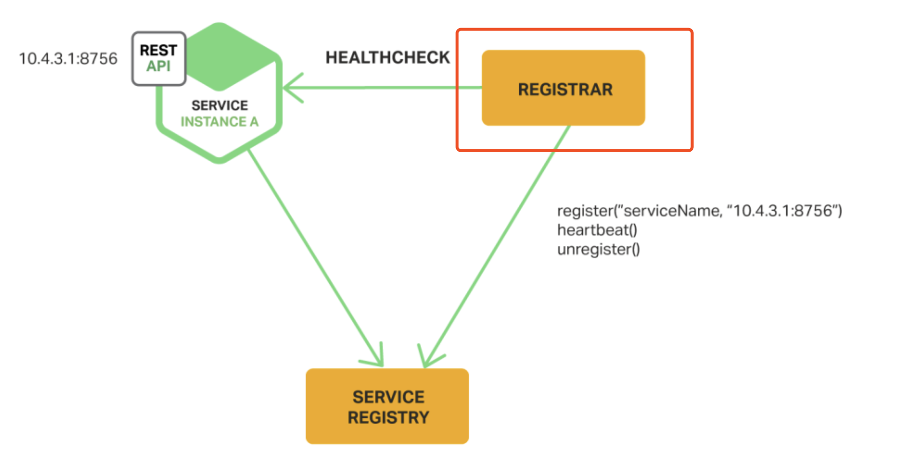
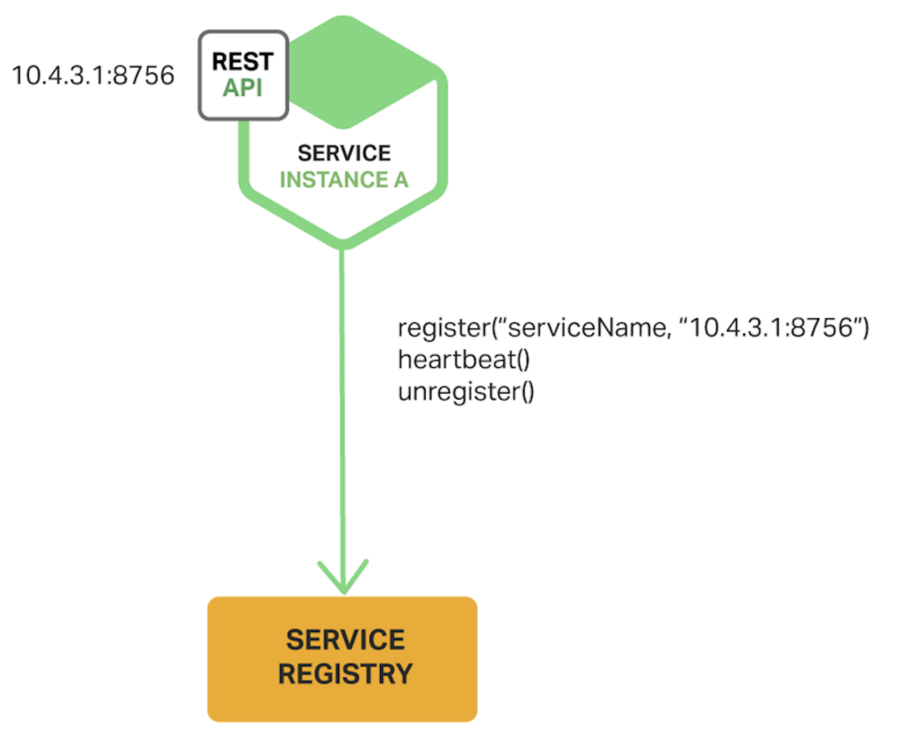

# Why? 
---
不是微服务的时候，我们的服务端和客户端的ip地址是固定的。因此我们只需要将服务端的地址hardcode进入客户端的代码便可以实现通讯。但是这种方式我们很难实现我们服务端的动态伸缩，高可用。 

但是在微服务的架构中，我们服务端可能会存在着迁移，伸缩的情况（这会造成服务端的地址是不固定的）。这个时候就需要有一套服务发现的机制来解决这些问题 

# What？ 
---
无论服务端的地址如何变化，客户端发起请求的时候，总有办法找到服务端的位置 

# How？ 
---
一般有两种主要的方式，一种是客户端发现，一种是服务端发现。无论两种方法的哪种方法，都需要一个注册中心，注册中心知道服务端的地址的变化 

#### 客户端发现 
客户端发现具体实现方法是指的客户端自己需要与注册中心交互。因为在服务启动的时候，会把自己的位置信息高速注册中心。 
这种方法优点就是客户端会有更多的权限，可以自己制定负载均衡的策略（但好像并不是很需要，对客户端的开发量显著增加，而且对于web的客户端几乎无法实现） 
但是这种方法有一个明显的缺点，就是需要在客户端实现服务位置发现的逻辑，耦合性比较重 

## 服务端发现 
俗话说的好，在软件领域的所有问题都可以通过添加一个中间层来实现。既然不想让客户端来实现逻辑，那么把这个模块放在注册模块之前，客户端去访问这个模块不就好了么？而这个模块其实就是传说中的LoadBalancer。 

优点已经很明显了，如果说缺点有的话，那就是需要维护这个loadbalancer。但是其实已经有非常多的loadbalancer的策略。 

我们一般采用的也都是服务端发现的模式 

## 服务注册中心 
可以看出来，服务注册中心是该模式中的核心组件，无论哪种方式，都是需要一个服务注册中心的。 

一般服务注册中心的策略都是，server在启动的时候向注册中心注册，并与注册中心维持心跳（隔一段之间服务端向注册中心发送put请求）。当心跳超时或者发送delete请求的时候，服务注册中心会删除该服务。 

目前主要用的一些注册中心服务： 

Etcd：高度可用，分布式，一致性的键值存储，用来共享配置或作为服务注册中心。Kubernetes和Cloud Foundry 这两个著名的项目使用了它； 

Consul：一个发现和配置服务的工具，提供了API允许客户端注册并发现服务，也能通过健康检查来确定服务的可用性； 

Apache ZooKeeper：用于分布式应用的广泛使用的、高性能的协调服务。开始作为Hadoop的子项目，但是现在是一个独立的顶级项目； 

其实上述的服务本质上都是提供一种持久化，高可用的key-value存储。附上etcd团队的写的几种主流的技术对比 

https://github.com/etcd-io/etcd/blob/master/Documentation/learning/why.md 

当然，etcd吊打其他几种方式。只有对NewSQL方式etcd表示如果你的存储量超过了GB级别，而且需要丰富的sql查询，你可以使用NewSQL。其他的时候使用etcd就好了，吊打其他友商。 

 

 

### 服务注册：   
服务注册也有两种方式，一种是服务直接向服务中心注册，另外一种是有一个专门的注册中间件，来负责将服务注册到注册中心。 
#### 直接注册 

直接注册的方式比较容易理解，也非常的直观。但是缺点也同样明显，就是服务端需要与注册中心有一个比较强的耦合关系。 

#### 通过中间件注册 

还是那句俗话，软件设计领域所有的事情都可以通过增加一个中间件来完成。具体的做法是中间件通过轮询部署环境中的服务或者订阅事件来追踪服务实例的变化，代替服务本身完成与注册中心的交互。红框内就是我们的注册中间件。 

参照： https://blog.csdn.net/lmy86263/article/details/75156520 