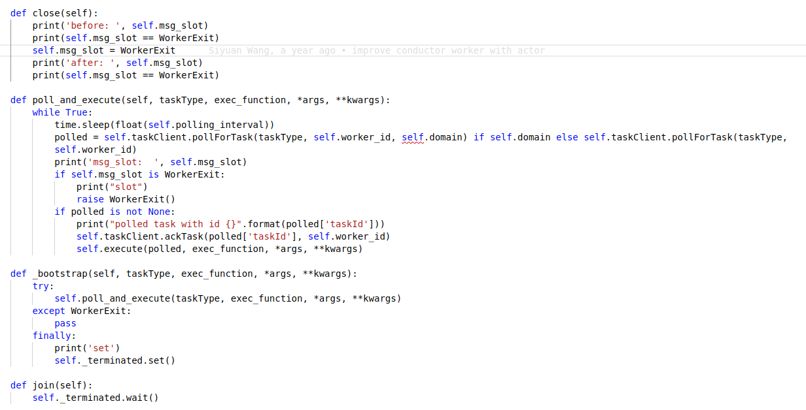

多进程与中止 
https://blog.csdn.net/qq_35883464/article/details/85112762 
 
简单验证 
```python
from multiprocessing import Event 
  
e = Event()                   创建了一个事件 
print(e.is_set())      False       查看一个事件的状态,默认被设置成阻塞 
e.set()                       将这个事件的状态改为True 
print(e.is_set())      True 
e.wait()                      是依据e.is_set()的值来决定是否阻塞的 
print(123456) 
e.clear()                     将这个事件的状态改为False 
print(e.is_set())      False 
e.wait()                      等待（等待时为阻塞）事件的信号被变成True 
print('*'*10) 
```
 
红绿灯 
 
```python
import time 
import random 
from multiprocessing import Event,Process 
def cars(e,i): 
    if not e.is_set(): 
        print('car%i在等待'%i) 
        e.wait()    # 阻塞 直到得到一个 事件状态变成 True 的信号 
    print('\033[0;32;40mcar%i通过\033[0m' % i) 
  
def light(e): 
    while True: 
        if e.is_set(): 
            e.clear() 
            print('\033[31m红灯亮了\033[0m') 
        else: 
            e.set() 
            print('\033[32m绿灯亮了\033[0m') 
        time.sleep(2) 
  
if __name__ == '__main__': 
    e = Event() 
    traffic = Process(target=light,args=(e,)) 
    traffic.start() 
    for i in range(20): 
        car = Process(target=cars, args=(e,i)) 
        car.start() 
        time.sleep(random.random()) 
```

### 错误示范
